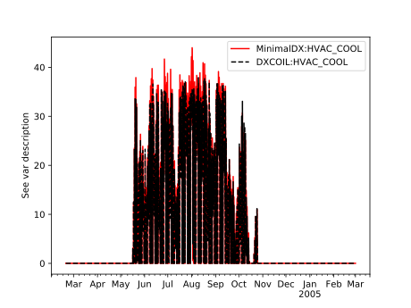

# _Minimal_**DX** comparative tests

These tests are simple comparative tests against the legacy 'DXCOIL' implementation to check that the coupled TEB-_Minimal_**DX** model can produce 'sensible' results, and how the results compare with the legacy 'DXCOIL' implementation.
The _Minimal_**DX** implementation has already been tested and compared against the original EnergyPlus implementation -- for more information see the `tests` repository in [_Minimal_**DX**](https://github.com/dmey/minimal-dx).


## Results

The result below shows a qualitative comparison of `HVAC_COOL` using the different coil implementations, for all other variables, see the `plots` folder.




## How to run the tests

``` sh
# Assumes python3.6 or above
pip3 install -r requirements.txt
python3 compare.py
```

This will run TEB and produce the plot included under [Results](#results).

